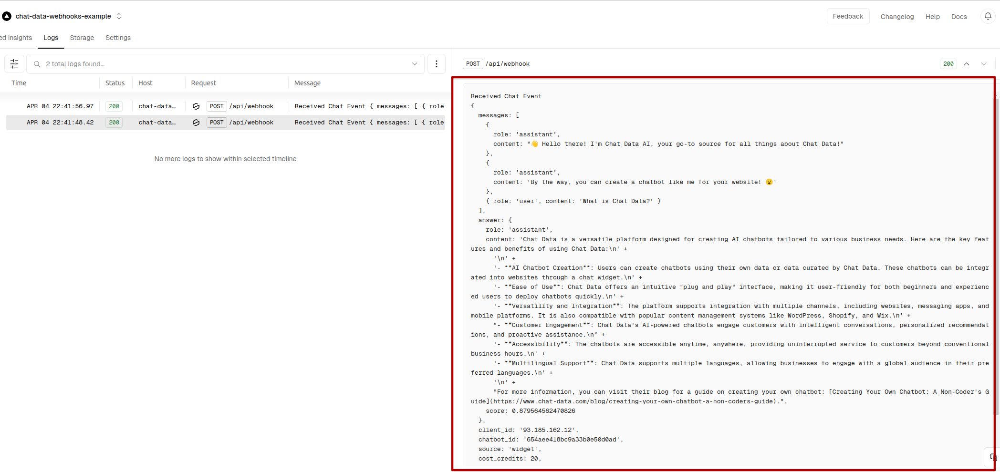
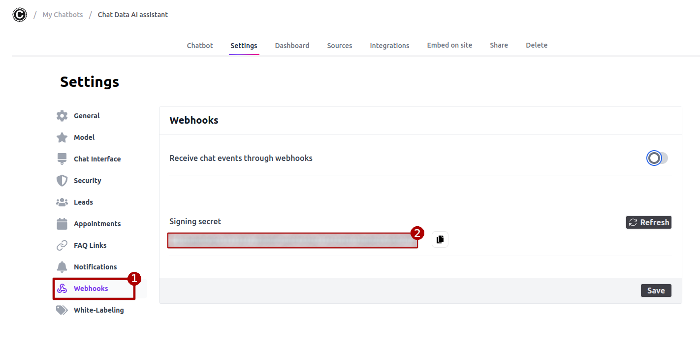
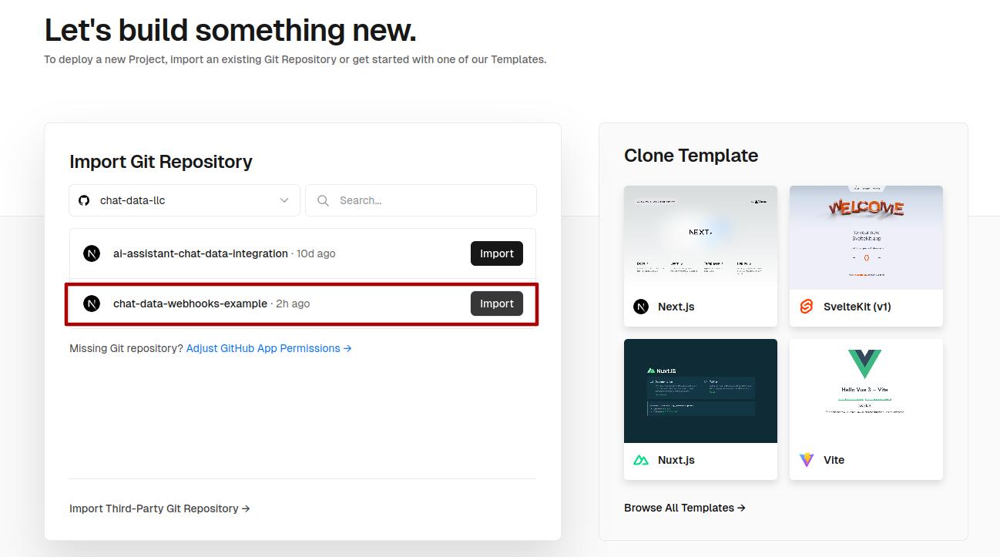
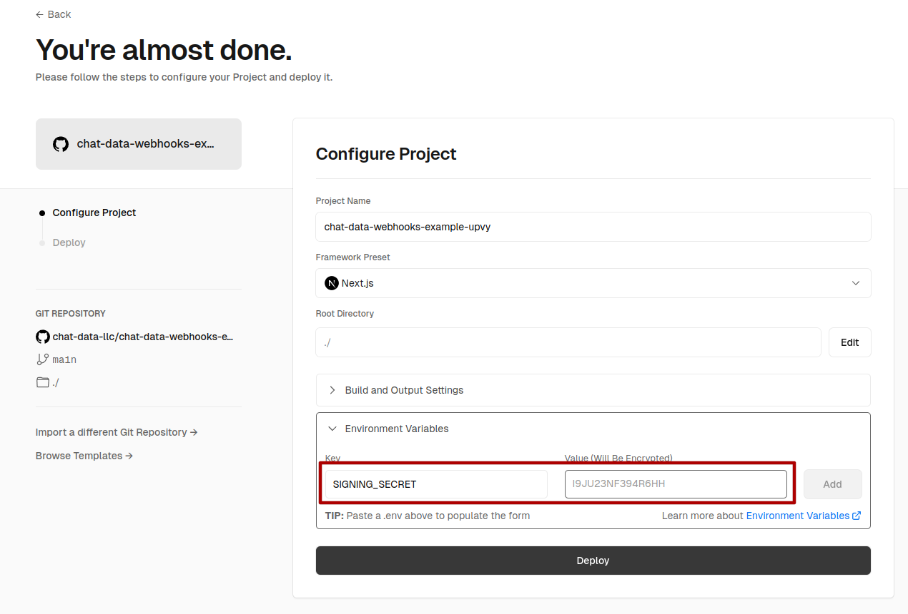
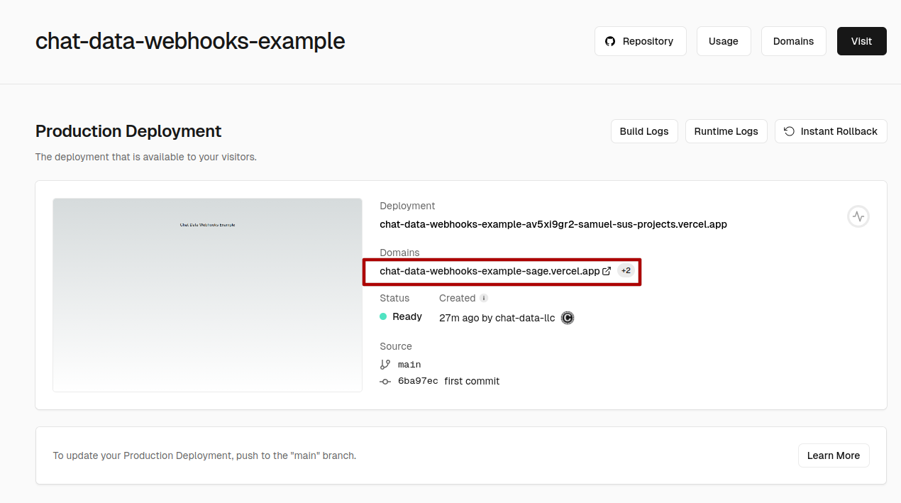
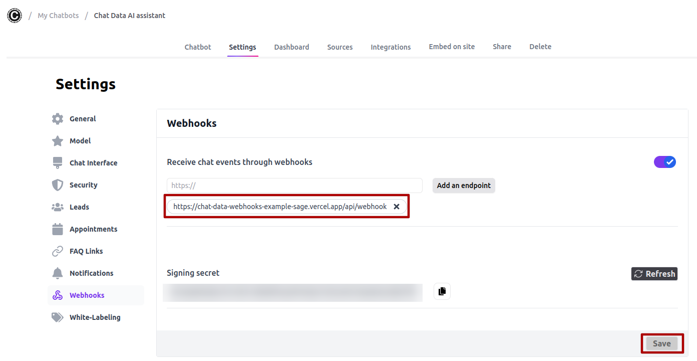

# [Chat Data](https://www.chat-data.com/) Webhook Integration Example

## Introduction
This repository showcases webhook integration for real-time `chat` events retrieval from the Chatbot website or third-party platforms integration solution of [Chat Data](https://www.chat-data.com/). Clients can leverage this functionality to monitor usage, implement exclusive chatbots for subscribed users, and ensure secure management of chat history.

# Demo Page

# Path

- `src/pages/api/webhook.js`: Endpoint for receiving `chat` events.

## Deployment with Vercel

### 1. Set Up the Environment Variables

- `SIGNING_SECRET`: 
If you're subscribed to the **Standard** or **Professional** plan of [Chat Data](https://www.chat-data.com/pricing), you can obtain your SIGNING_SECRET from the **Webhooks** section within the **Settings** tab.

### 2. Vercel deployment

- Click **Import** to import your project:

- Add Environment Variables:

 
- Obtain your deployed page's domain name:

- Add your Webhook endpoint in [Chat Data](https://www.chat-data.com/) and click **Save**. We allow up to three endpoints per chatbot. For additional endpoints, please contact us:

- You're all set! After chatting with your chatbot, you should observe something similar to the following picture in your logs. You can process or save the event payload as per your requirements.

## Conclusion

The Chat Data webhook solution facilitates real-time event synchronization with the clients' server, enabling customization of the chatbot integration experience. This functionality seamlessly integrates with website or third-party platforms integration such as Discord, Slack, or WhatsApp.

## Contact

[Chat Data LLC](admin@chat-data.com)
